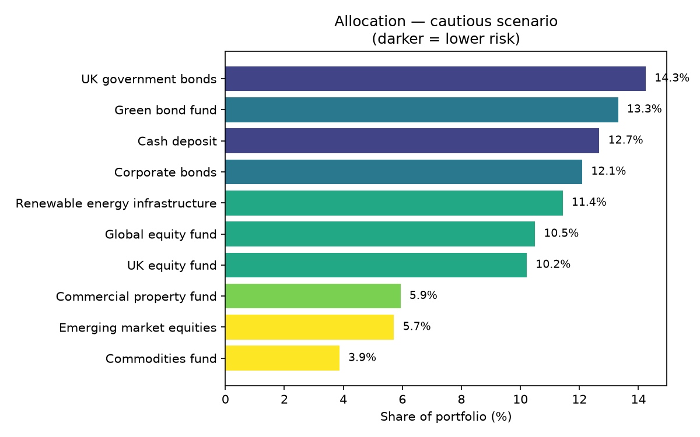

# Portfolio Allocator

A Python tool that splits an investment across a list of assets according to a chosen
scenario, then explains the trade-off it made to get there.



## Why I built it

At an Aviva Investors insight day I was put in a team of four and given 15 minutes to
decide how to allocate an investment across different asset classes and justify it
against the firm's priorities, including sustainability. Each option came with a risk
rating out of five stars, an expected return and an impact rating. Our team won the
presentation.

The hard part was that no option won on all three measures: the highest returns carried
the highest risk, and the strongest impact was rarely the most profitable. We had to
decide what we were optimising for and defend it.

This tool is that decision written as code. Instead of arguing the trade-off once, the
scenario weights make it explicit, and you can see how the answer changes when the
priority changes.

I am a BTEC Engineering student with no coding on my syllabus. This is my second Python
project.

## How it decides

Every asset has three attributes: **risk** (1 to 5 stars), **expected return**, and an
**impact score** for sustainability fit.

1. Each attribute is rescaled onto 0 to 1 so a percentage return can be compared against
   a star rating fairly
2. Risk is flipped into "safety", because low risk is the desirable direction
3. Each asset gets a weighted score, with the weights set by the scenario
4. Scores become percentages of the portfolio, with two rules applied:
   - **no asset exceeds 25%**, so the portfolio stays diversified
   - **average portfolio risk must stay under the scenario's ceiling** — if it doesn't,
     the riskiest asset is dropped and the allocation is recalculated

## The scenarios

| Scenario | Return | Impact | Safety | Risk ceiling |
|---|---|---|---|---|
| `cautious` | 25% | 15% | 60% | 2.5 stars |
| `balanced` | 40% | 25% | 35% | 3.2 stars |
| `growth` | 65% | 10% | 25% | 4.0 stars |
| `sustainable` | 30% | 50% | 20% | 3.5 stars |

## How to run it

```bash
pip install pandas matplotlib
python3 allocate.py cautious
python3 allocate.py growth
python3 allocate.py sustainable
```

## Example output

```
PORTFOLIO ALLOCATION — CAUTIOUS (protect the money first)
==========================================================================
UK government bonds                 14.3%   risk 1★  return 3.5%  impact 3
Green bond fund                     13.3%   risk 2★  return 4.5%  impact 5
Cash deposit                        12.7%   risk 1★  return 2.0%  impact 2
Corporate bonds                     12.1%   risk 2★  return 5.0%  impact 3
Renewable energy infrastructure     11.4%   risk 3★  return 6.5%  impact 5
...
Expected return   5.53%
Average risk      2.46 stars (ceiling 2.5)
Average impact    3.17 out of 5
```

Switching to `growth` lifts expected return to 6.68% and pushes emerging market equities
from 5.7% of the portfolio to 14%. That is the trade-off made visible: the extra return
is bought with risk, and average impact falls from 3.17 to 2.94.

## The data

`data/assets.csv` holds **illustrative figures**, not live market data. The expected
returns and impact scores are placeholders for demonstrating the method.

## What I would add next

- Real return figures from published fund factsheets rather than illustrative ones
- A minimum allocation per asset class, so the portfolio can't drop bonds entirely
- Show how each scenario would have performed against actual historical returns

## What I learned

- Why comparing a percentage return against a star rating needs both to be rescaled first
- How a constraint changes an answer: the risk ceiling forces assets out of the portfolio
  rather than just reducing them
- Writing a loop that recalculates until a condition is satisfied
- Passing an argument from the command line so one script handles four scenarios
